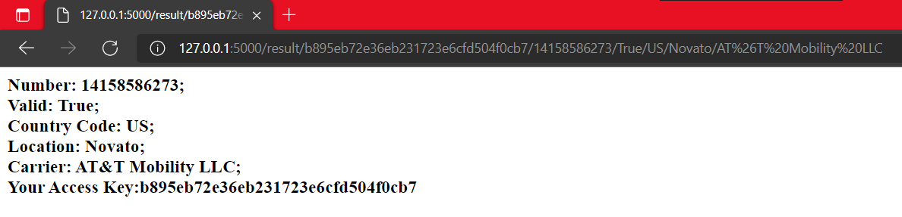

# NumVerifyPythonFlaskDemo

## Create Environment
`py -m venv env`

## Activate Environment
`env\Scripts\activate`
`source env/bin/activate`

## Install Flask & Set Flask App
`pip install flask`
`pip install requests`
`set FLASK_APP=app.py`

Delphi FMX Demo: https://github.com/MuminjonGuru/NumVerifyAPIDelphiFMX
NodeJS DEMO: https://github.com/MuminjonGuru/NumverifyDEMO
